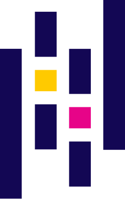

# 👋 Hi, I’m @chengxilo 🥰

## ✨ About me

  

My name is Chengxi Luo. I am an undergraduate student major in Computer Science. I enjoy learning new technologies and building projects.

I learnt software engineering in Changsha University &
Science Technology for 2 years and transfer to the U.S. Currently, I am learning computer science in the New York City. 

## 💻 Technologies & Experiences
### 🔧 Programming Languages

### 🌐 Frontend Development

### 🛠️ Backend Development

### 📊 Data Analysis

### 🔐 Cyber Security

## 📫 How to reach me

- Email: chengxi.luo2004@gmail.com

### 🗣️ Languages I use

- Chinese Mandarin (Native)
- English (Fluent)
- Japanese (Elementary)

